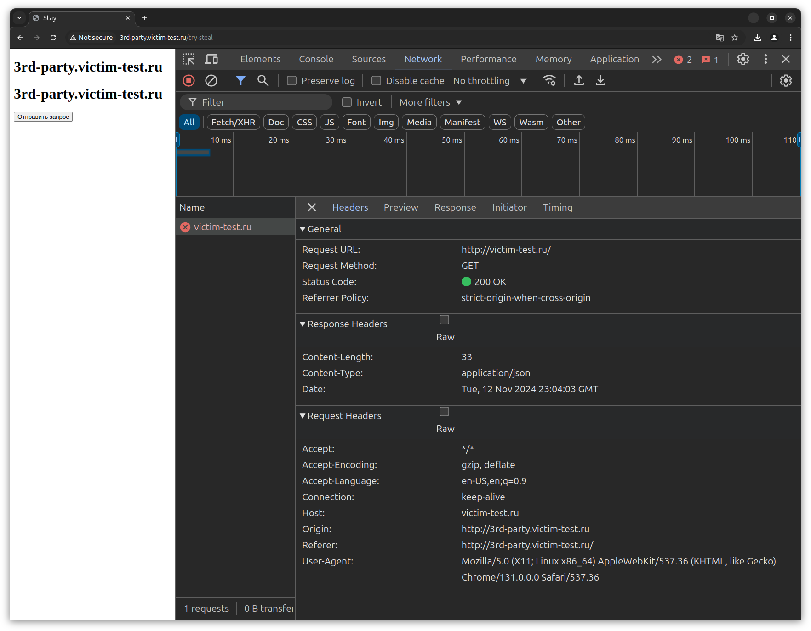
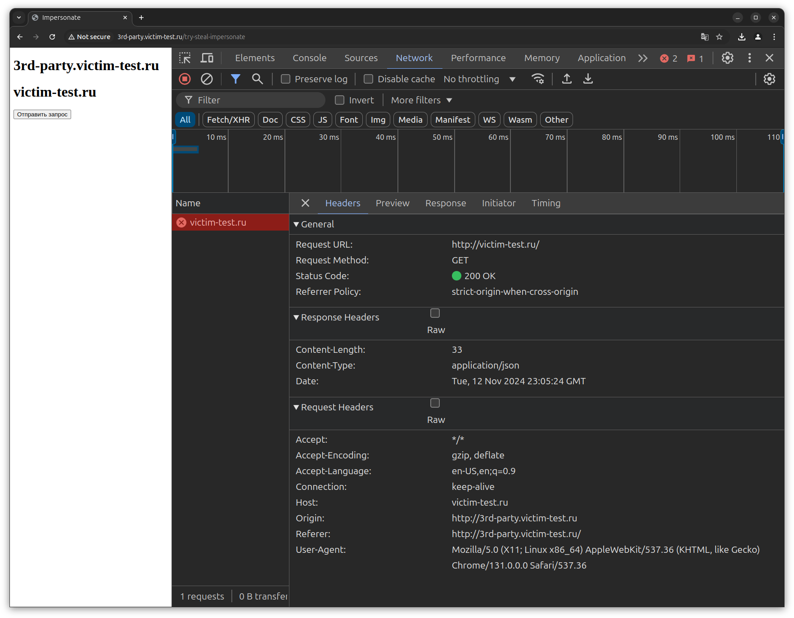
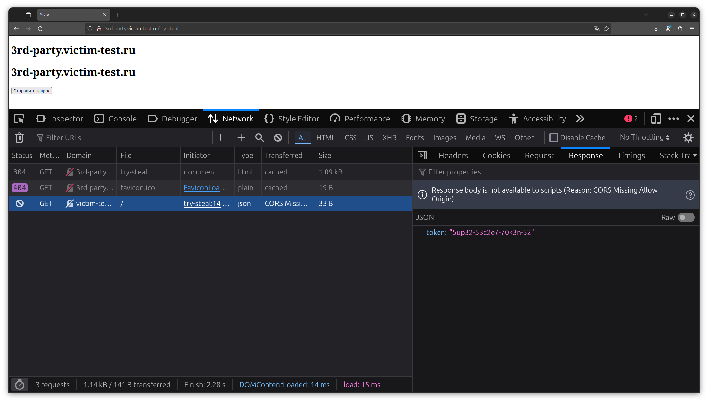
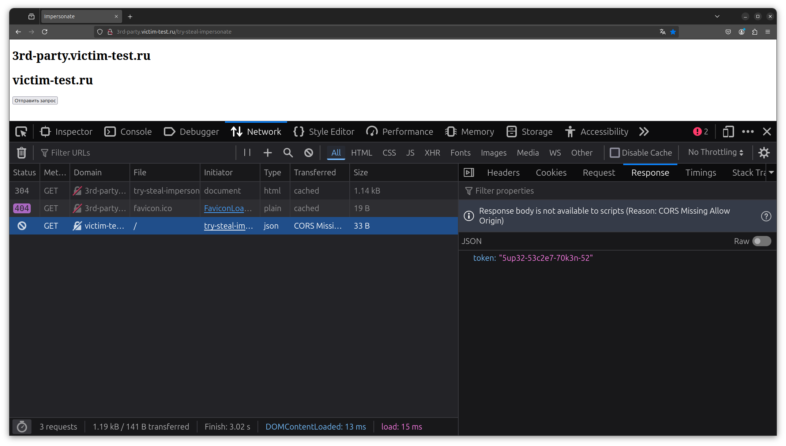

# Can `document.domain` still be used to bypass SOP within same-site 'cross-origin' non-preflighted requests?

`document.domain` allows to overwrite document's domain by any of its superdomains

> Hypothesis: This behavior may lead to SOP bypass (`3rd-party.victim.ru` accesses sensetive data from `victim.ru` within non-preflighted requests)

> Fact: No, it may not. At least in most browsers. Overwritten domain affects nothing from now on. Google Chrome, Mozilla Firefox, and Opera were checked

    
    

    
    

# Sources

1. https://developer.mozilla.org/en-US/docs/Web/API/Document/domain
2. https://learn.microsoft.com/en-us/deployedge/edge-learnmore-origin-keyed-agent-cluster
